

<!-- En-tête avec photo -->
<header class="text-center mb-2">
  
</header>

<!-- Accroche -->
<section class="text-center mb-3" style="line-height: 1.6;">
  <h2 style="color: var(--secondary);">De la Reconversion à la Révélation : Mon Pari Gagnant</h2>
  

    <strong>Rigueur scientifique • Esprit critique & analytique • Innovation • Collaboration • Autonomie</strong>
  

</section>

<!-- Icônes de contact -->
<nav class="text-center mt-2">
  <!-- Email -->
  
  <!-- LinkedIn -->
  
  <!-- GitHub -->
  
  <!-- CV -->
  
  <!-- Localisation -->
  
</nav>

<!-- Navigation rapide -->
<nav class="text-center mb-2" aria-label="Navigation principale">
  <a href="#apropos" class="nav-btn">À Propos</a>
  <a href="#competences" class="nav-btn">Compétences</a>
  <a href="#projets" class="nav-btn">Projets</a>
  <a href="#formation" class="nav-btn">Formation</a>
  <a href="#experiences" class="nav-btn">Expériences</a>
  <a href="#contact" class="nav-btn">Contact</a>
   
   
  <strong>Disponible pour un CDI/CDD sur Montpellier et alentours</strong>
</nav>

<!--séparation-->

<!-- À propos -->
<section id="apropos" class="container mb-3">
  <header class="text-center">
    <h1><strong>👋 À Propos de moi</strong></h1>
  </header>

  <article class="text-center">
    
Je suis <strong>Data Analyst</strong>, avec un parcours scientifique axé sur l'analyse et l'expérimentation. 
    Je transforme la donnée en <strong>outils décisionnels simples, fiables, élégants, utiles et actionnables.</strong> 
    Avec deux reconversions réussies et une expérience scientifique solide en laboratoire, mon parcours démontre des qualités précieuses dans le domaine de la Data :

    

    <ul style="text-align: left; display: inline-block;">
      <li>ma <strong>persévérance</strong> et ma <strong>motivation</strong> face aux défis complexes,</li>
      <li>ma <strong>forte capacité d'adaptation</strong> et <strong>d'apprentissage</strong>,</li>
      <li>ma <strong>curiosité intellectuelle</strong> toujours en éveil.</li>
    </ul>
  </article>  

  <article class="text-center">
  <h2>🧩 Ce qui me définit</h2>

  

    <table style="border-collapse: collapse; border: none; margin: 0 auto;">
      <tbody>
        <tr>
          <td style="text-align: right; padding: 0.3rem 0.5rem; border: none; white-space: nowrap;">
            <strong>Rigueur</strong>
          </td>
          <td style="text-align: center; padding: 0.3rem 0.5rem; border: none; font-size: 1.2em;">
            🎯
          </td>
          <td style="text-align: left; padding: 0.3rem 0.5rem; border: none; white-space: nowrap;">
            <strong>Amélioration</strong>
          </td>
        </tr>
        <tr>
          <td style="text-align: right; padding: 0.3rem 0.5rem; border: none; white-space: nowrap;">
            <strong>Analyse</strong>
          </td>
          <td style="text-align: center; padding: 0.3rem 0.5rem; border: none; font-size: 1.2em;">
            🔍
          </td>
          <td style="text-align: left; padding: 0.3rem 0.5rem; border: none; white-space: nowrap;">
            <strong>Structuration</strong>
          </td>
        </tr>
        <tr>
          <td style="text-align: right; padding: 0.3rem 0.5rem; border: none; white-space: nowrap;">
            <strong>Ingéniosité</strong>
          </td>
          <td style="text-align: center; padding: 0.3rem 0.5rem; border: none; font-size: 1.2em;">
            💡
          </td>
          <td style="text-align: left; padding: 0.3rem 0.5rem; border: none; white-space: nowrap;">
            <strong>Sens pratique</strong>
          </td>
        </tr>
        <tr>
          <td style="text-align: right; padding: 0.3rem 0.5rem; border: none; white-space: nowrap;">
            <strong>Visualisation</strong>
          </td>
          <td style="text-align: center; padding: 0.3rem 0.5rem; border: none; font-size: 1.2em;">
            📊
          </td>
          <td style="text-align: left; padding: 0.3rem 0.5rem; border: none; white-space: nowrap;">
            <strong>Pédagogie</strong>
          </td>
        </tr>
        <tr>
          <td style="text-align: right; padding: 0.3rem 0.5rem; border: none; white-space: nowrap;">
            <strong>Collaboration</strong>
          </td>
          <td style="text-align: center; padding: 0.3rem 0.5rem; border: none; font-size: 1.2em;">
            🤝
          </td>
          <td style="text-align: left; padding: 0.3rem 0.5rem; border: none; white-space: nowrap;">
            <strong>Autonomie</strong>
          </td>
        </tr>
        <tr>
          <td style="text-align: right; padding: 0.3rem 0.5rem; border: none; white-space: nowrap;">
            <strong>Adaptation</strong>
          </td>
          <td style="text-align: center; padding: 0.3rem 0.5rem; border: none; font-size: 1.2em;">
            💪
          </td>
          <td style="text-align: left; padding: 0.3rem 0.5rem; border: none; white-space: nowrap;">
            <strong>Curiosité</strong>
          </td>
        </tr>
      </tbody>
    </table>
  

</article>  

  <article class="text-center">
    <h2>🚀 Ma valeur ajoutée</h2>
    

      ✔ <strong>Définir une stratégie data</strong> alignée sur les objectifs métier et orientée vers la création de valeur. 
          

      ✔ <strong>Traduire des données complexes</strong> en insights clairs et compréhensibles pour une prise de décision éclairée. 
          

      ✔ Allier <strong>expertise technique</strong> (SQL, Python, outils de BI type Power BI) et <strong>pédagogie</strong> pour autonomiser les équipes. 
          

      ✔ <strong>Concevoir et déployer</strong> des tableaux de bord et des outils d'aide à la décision fiables, documentés et évolutifs. 
          

      ✔ <strong>Garantir</strong> une profonde rigueur analytique et méthodologique sur l'ensemble des processus.
    

  </article>  

  <article class="text-center">
    <h2>🌱 Ce que je recherche</h2>
    
Un poste de <strong>Data Analyst</strong> dans un <strong>environnement exigeant</strong> où la data est au cœur de la stratégie et de la prise de décision. 
        

      Je souhaite m'investir dans des projets <strong>concrets</strong>, à <strong>fort impact</strong>, alliant <strong>logique</strong>, <strong>innovation</strong> et <strong>travail d'équipe.</strong>

  </article>  

  <article class="text-center">
    <h2>📌 Ma méthodologie</h2>
    

      <strong>Comprendre le besoin</strong> 
      <strong>↓</strong> 
      <strong>Analyser les données</strong> 
      <strong>↓</strong> 
      <strong>Clarifier et transmettre les résultats</strong> 
      <strong>↓</strong> 
      <strong>Proposer des actions</strong>
    

  </article>
</section>

<!-- CV et haut de page -->
<footer class="text-center mb-1">
  <a href="/assets/CV/CV_Elodie_HEINRY_DataAnalyst.pdf" target="_blank" class="btn-cv">
    📄 Téléchargez mon CV
  </a> 

  <a href="#top" class="btn-top">↑ Haut de page</a>
</footer>

<!--séparation-->

<!-- Mes compétences -->
<section id="competences" class="container mb-3" style="text-align: center;">
  <header>
    <h1><strong>🛠️ Compétences</strong></h1>
  </header>
  
  

    <!-- Bloc Techniques -->
    

      <h2>📈 Techniques</h2> 
      

        <strong>Analyse & Traitement :</strong> Python, Pandas, NumPy, Statsmodels, Excel, Power Query, DAX    
          

            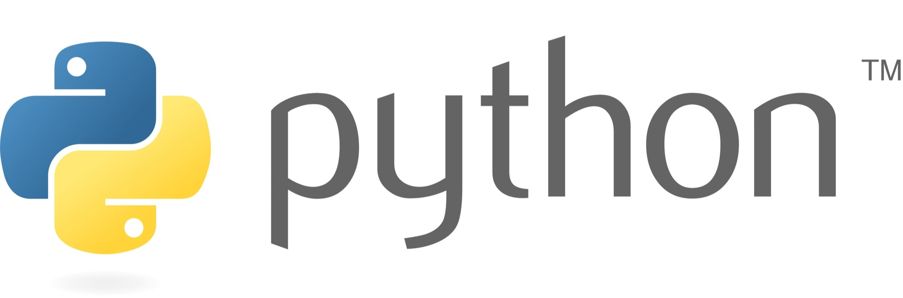
            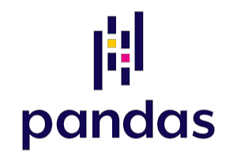
                    
            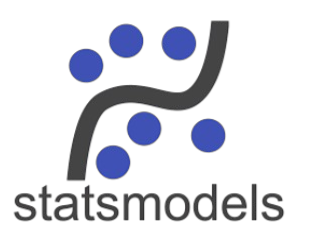
            
            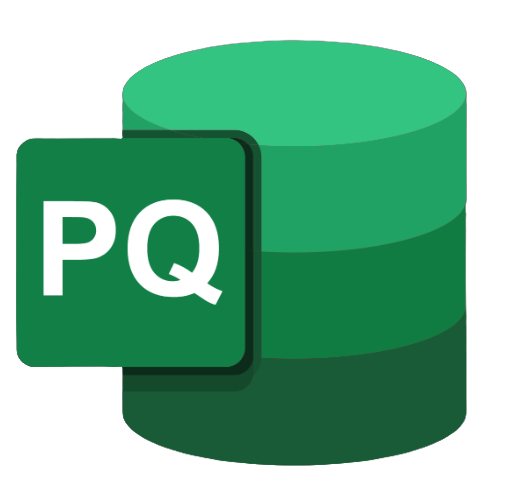
            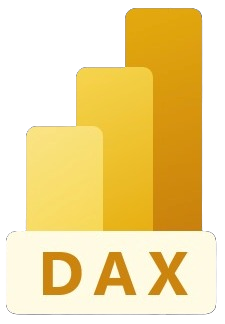
          
 
        <strong>Visualisation & BI :</strong> Power BI, Tableau, Looker Studio, Matplotlib    
          

            
            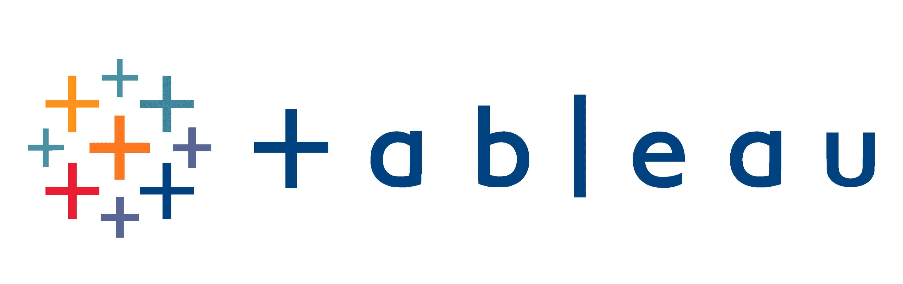
                 
            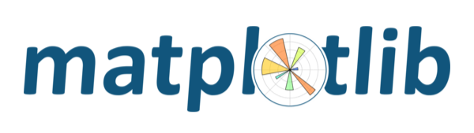
          
 
        <strong>Bases de données & ETL :</strong> SQL, MySQL, Snowflake, DBT    
          

            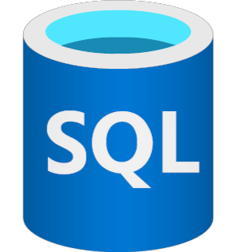
            
            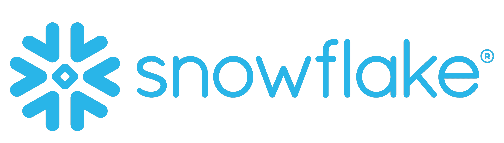     
            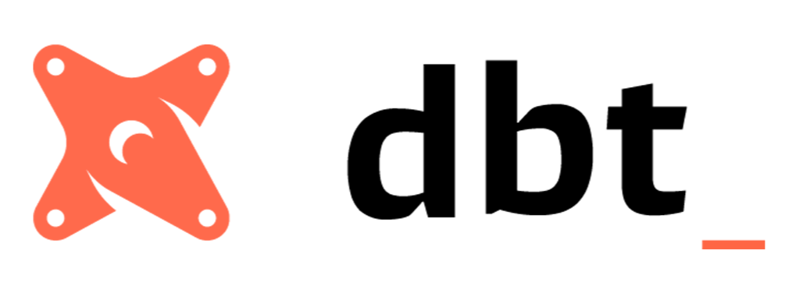
          
 
        <strong>Modélisation & ML :</strong> Régression, Decision Tree, Feature Engineering, Scikit-Learn, Dataiku    
          

                        
            
          

      
 
    

    <!-- Compétences Métier -->
    <h2>🎯 Compétences Métier</h2>
    <ul style="list-style: none; padding-left: 0; margin: 1.5rem 0;">
      <li>• <strong>Traduire</strong> des besoins métier en <strong>problématiques data</strong></li>
      <li>• Définir et suivre des <strong>KPI métier</strong></li>
      <li>• Raconter des histoires avec les données (<strong>Storytelling</strong>)</li>
      <li>• Développer des <strong>solutions Business Intelligence</strong></li>
      <li>• Travailler en <strong>méthode Agile</strong></li>
    </ul>  
    <!-- Soft Skills -->
    <h2>💪 Soft Skills</h2>
    

      Raisonnement analytique
      Esprit d'analyse
      Adaptabilité
      Autonomie
      Collaboration
      Pédagogie
      Curiosité intellectuelle
      Résolution de problèmes
    
  
    <!-- Langues -->
    <h2>🌍 Langues</h2>
    
<strong>Français</strong> : langue maternelle 
    <strong>Anglais</strong> : Niveau B2 - Compétences professionnelles techniques
 
  

</section>

<!-- CV et haut de page -->
<footer class="text-center mb-1">
  <a href="/assets/CV/CV_Elodie_HEINRY_DataAnalyst.pdf" target="_blank" class="btn-cv">
    📄 Téléchargez mon CV
  </a> 

  <a href="#top" class="btn-top">↑ Haut de page</a>
</footer>

<!--séparation-->

<!-- Mes projets DATA -->
<section id="projets" class="container mb-3">
  <header class="text-center">
    <h1><strong>🚀 Mes Projets Data</strong></h1>
  </header> 

  <!-- Projet 1 Netflix-->
  

    

      

        <h2 style="margin: 0 0 0.5rem 0; color: #e50914;">
          
          <strong>NETFLIX – Analyse stratégique → → POWER BI & DAX – ONLYOFFICE</strong>
        </h2> 
        

          Création d'un <strong>dashboard interactif Power BI</strong> pour analyser la stratégie de contenu de Netflix, incluant des mesures <strong>DAX</strong> avancées sur un modèle de données préparé avec <strong>Power Query</strong>.
        

        

        

          <em><strong>Objectif métier :</strong> Décrypter la stratégie du géant du streaming pour créer l'engagement addictif de ses abonnés.</em>
        

        

        <!-- Capacités centrées -->
        

          
          
        
        
        

          Power Query
          Data Modeling
          Dashboard
          Visualisation
          Analyse exploratoire EDA
        

        

        <!-- Bouton centré -->
        

          <a href="https://github.com/Elo3534/NETFLIX_PowerBI_DAX_OnlyOffice" target="_blank" class="nav-btn">
            👨‍💻 Voir le projet sur GitHub
          </a>
        

      

    

  

  <!-- Projet 2 Aircraft-->
  

    

      

        <h2 style="margin: 0 0 0.5rem 0; color: #4b75ffdb;">
          
          <strong>AIRCRAFT – Infrastructure des données et analyse → → SQL – Snowflake – DBT – Deepnote</strong></h2> 
        

          <strong>Construction de l'infrastructure des données et analyses pour le secteur aérien, intérêt pour l'efficacité opérationnelle de la flotte, la charge des aéroports et la performance financière historique des compagnies aériennes.</strong>
        

        

        

          <em><strong>Objectif métier :</strong>Évaluer les ressources opérationnelles (flotte, aéroports) et identifier des leviers de croissance afin d'améliorer les performances des aéroports et des compagnies aériennes à l'étude.</em>
        

        

        <!-- Capacités centrées -->
        

          
          
          
          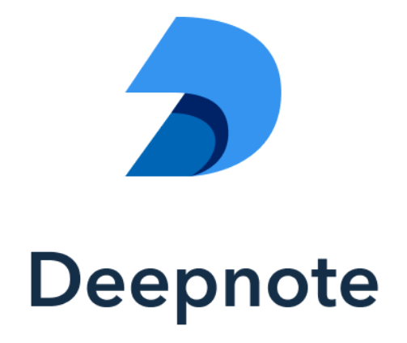
        
  
        

          Data Engineering
          Schéma en étoile
          Documentation
          Analyse exploratoire EDA
          Analyse descriptive
        

        

        <!-- Bouton centré -->
        

          <a href="https://github.com/Elo3534/Aircraft_DBT_SNOWFLAKE" target="_blank" class="nav-btn">
            👨‍💻 Voir le projet sur GitHub
          </a>
        

      

    

  

  <!-- Projet 3 Tinder-->
  

    

      

        <h2 style="margin: 0 0 0.5rem 0; color: #FF4B91;">
          
          <strong>TINDER – Analyse inférentielle → → Python – Pandas – NumPy – Statsmodels – SciPy – Matplotlib – Seaborn – Plotly – SciKit-Learn</strong>
        </h2> 
        

          <strong>Analyse descriptive et inférentielle sur les critères de sélection lors de speed-dating expérimentaux.</strong>
        

        

        

          <em><strong>Objectif métier :</strong>Optimiser la stratégie de matching en identifiant les critères de sélection réels, au-delà des déclarations, pour améliorer la pertinence des recommandations par l'application et ainsi l'engagement des abonnés.</em>
        

        

        <!-- Capacités centrées -->
        

          
          
                    
          
          
           
          
          
        

        

          Analyse exploratoire EDA
          Analyse descriptive
          Analyse inférentielle
        

        

        <!-- Bouton centré -->
        

          <a href="https://github.com/Elo3534/TINDER_python" target="_blank" class="nav-btn">
            👨‍💻 Voir le projet sur GitHub
          </a>
        

      

    

  

  <!-- Projet 4 IBM-->
  

    

      

        <h2 style="margin: 0 0 0.5rem 0; color: #4DA3FF;">
          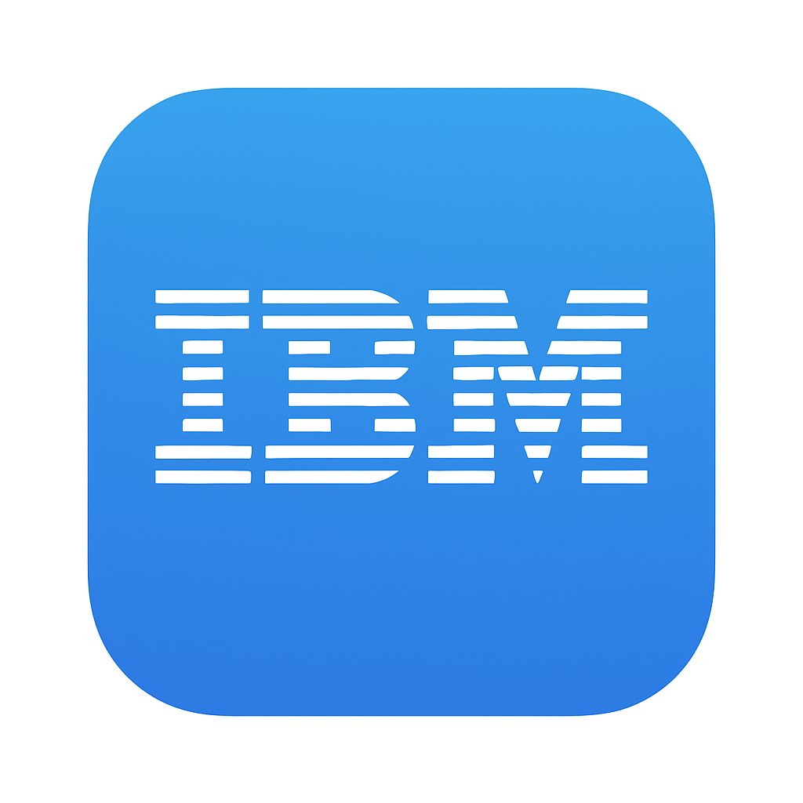
          <strong>ATTRITION CHEZ IBM – Analyse prédictive → → Tableau & Python – Microsoft Power Point – Word</strong>
        </h2> 
        

          <strong>Identification des drivers d'attrition</strong> chez IBM grâce au <strong>feature engineering</strong>,
          à l'analyse exploratoire (<strong>EDA</strong>) et à la modélisation prédictive (<strong>Machine Learning</strong>).
        

        

        

          <em><strong>Objectif métier :</strong> Déterminer les facteurs-clés influençant le turnover et fournir
          des insights actionnables pour anticiper la rétention des talents.</em>
        

        

        <!-- Capacités centrées -->
        

          
          
                     
                           
          
           
          
          
        

        

          Machine Learning
          Feature Engineering
          Analyse Prédictive
          Analyse exploratoire EDA
          Microsoft Office
        

        

        <!-- Bouton centré -->
        

          <a href="https://github.com/Elo3534/Attrition-IBM_Tableau_Python_Word" target="_blank" class="nav-btn">
            👨‍💻 Voir le projet sur GitHub
          </a>
        

      

    

  

</section>

<!-- CV et haut de page -->
<footer class="text-center mb-1">
  <a href="/assets/CV/CV_Elodie_HEINRY_DataAnalyst.pdf" target="_blank" class="btn-cv">
    📄 Téléchargez mon CV
  </a> 

  <a href="#top" class="btn-top">↑ Haut de page</a>
</footer>

<!--séparation-->

<!-- Mes formations et certifications -->
<section id="formation" class="container mb-3">
  <header class="text-center">
    <h1><strong>🎓 Formations & Certifications</strong></h1>
  </header>
    

  

    <!-- Parcours DATA -->
    

      <h2 style="color: #1F77B4; text-align: center;"><strong>📈 Parcours DATA</strong></h2>
      

        <h3 style="color: var(--primary); margin-bottom: 0.5rem;">🎓 <strong>CONCEPTION ET DÉVELOPPEMENT EN SCIENCES DE DONNÉES (CDSD)</strong></h3>
        
<strong>Montpellier – Novembre 2025</strong>

        

          Analyse exploratoire, descriptive et inférentielle de données. 
          Direction de projets de gestion de données.
        

        

          Titre professionnel de niveau bac +4 enregistré au RNCP. 
          Formation en <strong>Bootcamp : FULLSTACK DATA ANALYSIS</strong> chez Jedha Academy
        

      

      <h3 style="color: var(--primary); text-align: center;"><strong>🏅 Certifications Editeurs</strong></h3>
      

        Google Analytics 4 (GA4) – 2025 
        Hubspot CMR for Marketers – 2025
      

    

    

    <!-- Parcours scientifique -->
    

      <h2 style="color: #1bcafaff; text-align: center;"><strong>🔬 Parcours SCIENCES</strong></h2>
      

        <h3 style="color: var(--primary); margin: 0 0 0.5rem 0;">🎓 <strong>LICENCE PROFESSIONNELLE Biologie Analytique et Expérimentale (BAEMOVA)</strong></h3>
        
<strong>Angers – 2010</strong>

      

      

        <h3 style="color: var(--primary); margin: 0 0 0.5rem 0;">🎓 <strong>DUT GENIE BIOLOGIQUE en Analyses Biologiques et Biochimiques (ABB)</strong></h3>
        
<strong>Clermont-Ferrand – 2009</strong>

      

    

    

    <!-- Reprise d'étude -->
    

      <h2 style="color: #9b59b6; text-align: center; margin-bottom: 1rem;"><strong>💪 Reprise d'étude</strong></h2>
      

        <h3 style="color: var(--primary); margin: 0 0 1rem 0;">🎓 <strong>Licence Biologie Première Année</strong></h3>
        
<strong>Rennes – 2007</strong>

        

          <em>"J'ai voulu évaluer mes capacités d'apprentissage avant de me lancer dans une formation diplômante."</em>
        

        

          ✅ Année validée – Admissible en L2
        

      

      

        <h3 style="color: var(--primary); margin: 0 0 0.5rem 0;">🎓 <strong>DAEU B (Diplôme d'Accès aux Études Universitaires)</strong></h3>
        
<strong>Rennes – 2006</strong>

      

    

  

</section>

<!-- CV et haut de page -->
<footer class="text-center mb-1">
  <a href="/assets/CV/CV_Elodie_HEINRY_DataAnalyst.pdf" target="_blank" class="btn-cv">
    📄 Téléchargez mon CV
  </a> 

  <a href="#top" class="btn-top">↑ Haut de page</a>
</footer>

<!--séparation-->

<!-- Mes expériences professionnelles -->
<section id="experiences" class="container mb-3" style="text-align: center;">
  <header class="text-center" style="font-weight: bold;">
    <h1><strong> 🤝 Expériences Professionnelles</strong></h1>
  </header> 

  

    <!-- Expériences en Laboratoire -->
    

      <h2 style="color: #1bcafaff; margin-bottom: 1rem; text-align: center; font-weight: bold;">🔬 Expériences antérieures en Laboratoire</h2>
      

        <h3 style="color: #2c3e50; margin: 0 0 0.5rem 0; font-weight: bold;">agent de maîtrise en laboratoires de sciences</h3>
        
2017 – Lycée privé – Aix-en-Provence – 7 ans

        
Mission :

        <ul style="color: #555; line-height: 1.6; margin: 0 0 0.5rem 1.5rem; padding-left: 1.5rem;">
          <li>Référencement des produits chimiques (Intégration d'un outil informatisé)</li>
          <li>Mise en sécurité des laboratoires</li>
          <li>Gestion du budget</li>
          <li>Gestion du matériel</li>
          <li>Aide à la préparation des Travaux Pratiques</li>
          <li>Mise au point des protocoles expérimentaux pour les travaux pratiques</li>
        </ul>
      

      

        <h3 style="color: #2c3e50; margin: 0 0 0.5rem 0; font-weight: bold;">ingénieure d'étude en cytogénétique</h3>
        
2010 – INRAE – Angers – 3 ans

        

          <em>Analyse cytogénétique de 8 genres de plantes ornementales pour un projet partenarial (Breeding Research & Innovation on Ornamentals).</em>
        

        
Mission :

        <ul style="color: #555; line-height: 1.6; margin: 0 0 1rem 1.5rem; padding-left: 1.5rem;">
          <li>Conception et mise au point de protocoles de cytogénétique moléculaire et de cytométrie de flux</li>
          <li>Analyses sur 8 genres de plantes ornementales</li>
          <li>Analyses statistiques inférentielles</li>
          <li>Etude bibliographique, synthèses et présentations visuelles des études</li>
          <li>Présentation régulière des résultats avec supports visuels en comités techniques (16 fois/an)</li>
          <li>Mise au point des protocoles expérimentaux</li>
          <li>Collaboration avec équipes pluridisciplinaires et partenaires externes</li>
        </ul>
        
Réalisations marquantes :

        <ul style="color: #555; line-height: 1.6; margin: 0 0 1rem 1.5rem; padding-left: 1.5rem; text-align: justify;">
          <li>Mise en place, maintenance, formation et accompagnement des utilisateurs et complète autonomie sur un cytomètre en flux, en microscopie à fluorescence</li>
          <li>Organisation des laboratoires de cytologie, de microscopie à fluorescence, de cytométrie de flux : rédaction de manuels utilisateurs, formation et accompagnement des utilisateurs, gestion des stocks, des commandes et des budgets liés aux laboratoires</li>
          <li>Participation à des conférences internationales (Prague 2012, Paris 2011, Montpellier 2010)</li>
        </ul>
      

    

    <!-- Expériences en industrie -->
    

      <h2 style="color: #FF8C00; margin-bottom: 1rem; text-align: center; font-weight: bold;">🏭 Expériences antérieures en industrie</h2>
      

        <h3 style="color: #2c3e50; margin: 0 0 0.5rem 0; font-weight: bold;">conductrice de lignes automatisées et opératrice de fabrication</h3>
        
Entre 2002 et 2017 – Ipsen BioPharma – Valeo – Canon – Thalès Microelectronics – Oberthur Card Systems (Bouches-du-Rhône, Var, Maine-et-Loie, Ille-et-Vilaine)

        <ul style="color: #555; line-height: 1.6; margin: 0 0 1rem 1.5rem; padding-left: 1.5rem;">
          <li>Conduite de lignes automatisées et semi-automatisées (secteurs militaire, médical, bancaire)</li>
          <li>Contrôle qualité et respect des procédures (secteur militaire et pharmaceutique)</li>
          <li>Polyvalence et adaptation à différents environnements industriels</li>
        </ul>
      

    

    <!-- Stages professionnels -->
    

      <h2 style="color: #8E44AD; margin-bottom: 1rem; text-align: center; font-weight: bold;">📚 Stages professionnels</h2>
      

        
Stage Licence professionnelle – 2010 (4 mois par demande de prolongement)

        
AgroCampus-Ouest, Angers

        
Cytogénétique moléculaire et localisation de rétrotransposons par GISH/FISH chez le rosier.

      

        
Stage DUT – 2009 (3 mois par demande de prolongement)

        
Centre de lutte contre le cancer, Clermont-Ferrand

        
Etude des effets des phyto-oestrogènes du soja sur des cellules cancéreuses (cytométrie en flux, Western Blotting).

      

    

  

</section>

<!-- CV et haut de page -->
<footer class="text-center mb-1">
  <a href="/assets/CV/CV_Elodie_HEINRY_DataAnalyst.pdf" target="_blank" class="btn-cv">
    📄 Téléchargez mon CV
  </a> 

  <a href="#top" class="btn-top">↑ Haut de page</a>
</footer>

<!--séparation-->

<!-- Mon contact -->
<section id="contact" class="container mb-3">
  <header class="text-center">
    <h1><strong>📫 Contactez-moi</strong></h1>
  </header>
   
  

    

      

        📧
        <a href="mailto:heinryelodie@hotmail.fr">heinryelodie@hotmail.fr</a>
      

      

        📞
        06 18 70 42 77
      

      

        💼
        <a href="https://www.linkedin.com/in/elodie-heinry" target="_blank">Mon LinkedIn</a>
      

      

        👨‍💻
        <a href="https://github.com/Elo3534" target="_blank">Mon GitHub</a>
      

      

        🌐
        Montpellier
      

    

  

</section>

<!--séparation-->

<!-- Moi, en plus -->
<header class="text-center">
  <h1><strong>👁️ Vous vouliez en savoir plus ?</strong></h1>
</header> 

<article class="container text-center">
  

    <strong>🎮🎯 L'Experte en énigmes tordues</strong> - Mon cerveau adore les défis qui se terminent par un 'EURÊKA !' Parce que la vie sans casse-tête, c'est comme du code sans bug : c'est suspect...
      
    <strong>🌿🐾 L'Émerveillée</strong> - La nature est ma source d'inspiration préférée ! Je m'extasie devant un documentaire animalier et j'adore observer les animaux. Spoiler : ils sont meilleurs acteurs que nous.
      
    <strong>✈️🧳 L'Aventurière</strong> - Mon passeport a plus de tampons que mon carnet de notes. Mon sens de l'orientation ? 'Aller là où mon œil est attiré'. Prochaine destination : là où il y a de l'eau et des sourires à partager.
      
    <strong>💦💧 La Sirène</strong> - Si on me cherche, checkez les plans d'eau. C'est mon élément de prédilection, là où je puise énergie et sérénité, que ce soit en nageant, en pratiquant une activité nautique ou simplement en le contemplant.
      
    <strong>💬🤝 La Social Butterfly</strong> - Une bonne conversation, des fous rires, des débats passionnés... c'est mon carburant social préféré.
      
    <strong>📚 La Curieuse Littéraire</strong> - Entre deux datasets, mon esprit analytique s'évade dans les enquêtes policières, se nourrit de journalisme d'investigation et s'émeut devant la vérité humaine des romans intimistes.
      
    <strong>🔧🔨 La Bricoleuse Philosophe</strong> - Mes mains aiment créer pendant que mon cerveau déconstruit les problèmes. Et parfois, les deux s'emmêlent ! 75% de réussite en bricolage, 100% en détermination !
      
    En résumé : <strong>100% curieuse</strong>, <strong>0% routine</strong>, et un <strong>grand sourire</strong> face aux défis !
  

</article> 

<!-- haut de page -->
<footer class="text-center mb-1">
  <a href="#top" class="btn-top">↑ Haut de page</a>
</footer> 

<!-- Navigation rapide -->
<nav class="text-center mb-2" aria-label="Navigation principale">
  <a href="#apropos" class="nav-btn">À Propos</a>
  <a href="#competences" class="nav-btn">Compétences</a>
  <a href="#projets" class="nav-btn">Projets</a>
  <a href="#formation" class="nav-btn">Formation</a>
  <a href="#experiences" class="nav-btn">Expériences</a>
  <a href="#contact" class="nav-btn">Contact</a>
</nav>

<!-- Icônes de contact -->
<nav class="text-center mt-2">
  
  
  
  
  
</nav>
 
<footer style="text-align:center;">
  &copy; 2025 Élodie HEINRY – Tous droits réservés
</footer>